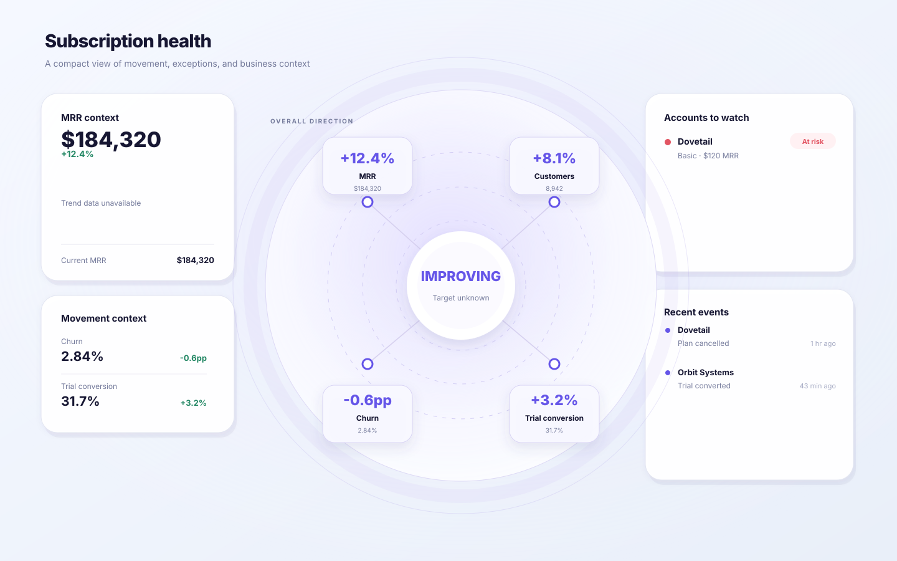

# Decision-First Dashboard

Turn KPI-heavy dashboards into decision-first dashboards without letting the agent invent the visual hierarchy.

Most dashboard prompts ask an LLM to **design**. This project treats dashboard redesign more like a small compiler:

```text
source dashboard / verified source file
      ↓
agent extraction + mode proposal
      ↓
grounded evidence bundle
      ↓
grounding + decision-state validation
      ↓
deterministic renderer
      ↓
SVG / HTML dashboard
```

> **Many metrics → minimum sufficient decision signals → diagnosis → action**

## Why this exists

A conventional dashboard often looks like:

```text
KPI   KPI   KPI   KPI

Chart             Activity

Table
```

The user still has to scan everything and construct the conclusion mentally.

Decision-First Dashboard changes the information hierarchy first. The agent extracts evidence; the compiler verifies that the evidence can be mechanically grounded back to source bytes before the deterministic renderer owns the layout.

## Two strict evidence modes

The compiler supports two mutually exclusive modes.

### 1. `no_score`

Use this when the source does not provide a defensible composite model.

For executive no-score cases, the rendered structure is deliberately constrained:

```text
WHY / CONTEXT  →  DOMINANT SYNTHESIS  ←  WHO / EVENTS
```

The output does **not** invent a Health Score. Overall direction is derived deterministically from source-supported signal directions.

<table>
  <tr>
    <th width="50%">Before</th>
    <th width="50%">Deterministic no-score output</th>
  </tr>
  <tr>
    <td width="50%"></td>
    <td width="50%"></td>
  </tr>
</table>

### 2. `composite`

Use this only when the source already provides a complete, defensible score model.

Composite v1 requires all of the following:

- an overall score and score scale;
- source-provided normalized component scores;
- source-provided component weights;
- a weighted-average aggregation rule;
- complete source-provided score bands / thresholds.

The validator checks that weights sum to 1, the displayed score matches the weighted average, component scores stay inside the declared scale, score bands are contiguous and cover the full scale, and the displayed band matches the score.

If any required model fact is missing, the correct fallback is `no_score` — not an inferred formula, guessed weight, or fabricated threshold.

The existing `examples/saas/after.png` remains a visual reference for a dominant score composition. It is **not** treated as proof that the canonical SaaS source fixture contains a real composite model.


The repository's composite JSON fixture lives under `tests/compiler/fixtures/` and is synthetic contract data used only for automated validation and rendering tests.

## V3 evidence grounding

V3 adds a hard grounding layer in front of the existing `no_score` / `composite` compiler. A source claim is no longer accepted merely because an agent writes `provenance: "source"`.

The production input is a **grounded bundle** containing:

- a source file path, source kind, and SHA-256;
- the closed `decisionState`;
- an evidence ledger;
- claim references from exact decision-state JSON Pointer paths to evidence IDs.

The compiler supports mechanically verifiable JSON Pointer grounding and exact text-span grounding. Composite scoring facts must all be grounded. Any missing or mismatched composite scoring evidence returns `FALLBACK_TO_NO_SCORE` and produces no composite dashboard.

Machine-readable transitions are:

```text
PASS
RETURN_TO_EVIDENCE_EXTRACTION
FALLBACK_TO_NO_SCORE
FIX_DECISION_STATE
```

Image-only/bounding-box claims are not treated as strong composite evidence in V3 because the repository does not currently ship a deterministic OCR/token extractor. Screenshot workflows should first create a verifiable text/JSON sidecar.

## Install

```bash
npx skills add fourleaf13-hue/decision-first-dashboard
```

The skill directory contains its own schema, validator, templates, and renderer. Runtime validation has no third-party dependency.

## Use

Give the agent a dashboard screenshot, Figma frame, existing dashboard code, or verified metrics and ask:

> Redesign this dashboard using the `decision-first-dashboard` skill. Preserve source evidence and produce the deterministic decision-first output.

The intended production execution path is:

1. Extract verified facts only.
2. Decide whether the evidence supports `no_score` or strict `composite` mode.
3. Build a closed `decisionState`.
4. Build the source hash, evidence ledger, and claim references in a grounded bundle.
5. Run the grounding compiler gate.
6. Render SVG and HTML only after `PASS`.
7. Inspect the output for evidence and visual integrity.

From the skill directory:

```bash
node scripts/compile.js path/to/grounded-bundle.json path/to/output-directory
```

`validate.js` and `render.js` remain lower-level Layer 2 / Layer 3 tools for tests and internal compiler use; V3 agent workflows should not bypass `compile.js`.

The renderer writes mode-specific filenames:

```text
no_score   → output.no-score.svg / output.no-score.html
composite  → output.composite.svg / output.composite.html
```

## Anti-hallucination contract

Both contracts are closed: `grounded-bundle.schema.json` constrains source/evidence/claim structure, and `decision-state.schema.json` constrains mutually exclusive `no_score` and `composite` states.

### No-score safeguards

The no-score branch rejects unsupported fields such as:

- invented `score` / health score;
- caller-supplied overall direction;
- invented target or goal fields;
- renewal/workflow/action/assignee fields;
- derived account exceptions or events presented as source facts;
- composite model fields.

Numeric trend series are optional. If exact source-supported points are unavailable, the renderer says `Trend data unavailable` instead of drawing a plausible-looking line.

### Composite safeguards

The composite branch accepts only source-supported score-model facts. It rejects, among other cases:

- missing component weights;
- weights that do not sum to 1;
- a score that does not equal the weighted average;
- component scores outside the declared score scale;
- score-band gaps or overlaps;
- a displayed status that does not match the source thresholds;
- unsupported normalization or aggregation methods.

Composite validation failure is never repaired by inventing the missing model.

## Direction is not health

In `no_score`, the agent does not provide `IMPROVING`, `MIXED`, or `DETERIORATING` as a top-level verdict. The renderer derives it from validated signal directions:

```text
all improving             → IMPROVING
improving + deteriorating → MIXED
all deteriorating         → DETERIORATING
flat only                 → FLAT
no known direction        → UNKNOWN
```

> `Improving` does not mean `Healthy`.

If targets or healthy ranges are unknown, the no-score UI says `Target unknown` rather than inventing adequacy.

## Deterministic visual contract

Both rendering branches use fixed templates and the same shared visual system.

### No-score composition

- one dominant center directional synthesis area;
- 3–6 signals converging on the center;
- compact left business context;
- compact right account exceptions and events.

### Composite composition

- one dominant center source-supported score and band;
- 3–6 weighted score components converging on the center;
- compact left score trend and score composition;
- compact right account exceptions and events.

### Shared constraints

- no four-equal-KPI top row;
- no dominant full-width customer table;
- no invented action buttons;
- no compiler/framework labels in visible UI;
- restrained SaaS visual styling.

SVG is the compatibility baseline. HTML/CSS is the higher-fidelity output. Both consume the same validated JSON.

## Repository structure

```text
decision-first-dashboard/
├── README.md
├── LICENSE
├── package.json
├── examples/
│   └── saas/
│       ├── before.png
│       ├── after.png
│       ├── input.no-score.json
│       ├── output.no-score.svg
│       ├── output.no-score.html
│       └── reasoning.md
├── skills/
│   └── decision-first-dashboard/
│       ├── SKILL.md
│       ├── schemas/
│       │   ├── grounded-bundle.schema.json
│       │   └── decision-state.schema.json
│       ├── scripts/
│       │   ├── grounding.js
│       │   ├── compile.js
│       │   ├── validate.js
│       │   └── render.js
│       ├── templates/
│       │   ├── no-score.svg
│       │   ├── no-score.html
│       │   ├── composite.svg
│       │   ├── composite.html
│       │   └── dashboard.css
│       └── references/
│           ├── visual-pattern.md
│           └── after-reference.png
└── tests/
    ├── compiler/
    │   ├── fixtures/
    │   │   ├── composite.valid.json
    │   │   └── grounding/
    │   ├── golden/
    │   ├── grounding.test.js
    │   ├── compile-cli.test.js
    │   ├── golden-snapshot.test.js
    │   ├── schema.test.js
    │   ├── composite-schema.test.js
    │   ├── render-svg.test.js
    │   ├── render-html.test.js
    │   ├── render-composite-svg.test.js
    │   ├── render-composite-html.test.js
    │   └── render-cli.test.js
    ├── saas.md
    ├── saas-no-score.md
    ├── visual-output.md
    ├── evidence-scope.md
    ├── ecommerce.md
    └── operations.md
```

## Development

```bash
npm test
npm run validate:saas
npm run render:saas
```

GitHub Actions runs the complete compiler test suite, including grounded composite/no-score compilation and byte-level golden snapshots, then renders the canonical SaaS and SaaSGrid fixtures and uploads generated artifacts for visual QA.

## What this is not

This is not a generic chart library and not a prompt that asks the model to freestyle a prettier admin dashboard.

The project separates three responsibilities:

- **Layer 1 / Agent:** evidence extraction and mode proposal.
- **Layer 2 / Compiler contract:** source grounding, claim coverage, schema/semantic validation, and machine-readable retry/fallback decisions.
- **Layer 3 / Renderer:** deterministic SVG/HTML composition only.

That separation is what makes the output repeatable across agents while making source support auditable.

## License

MIT
