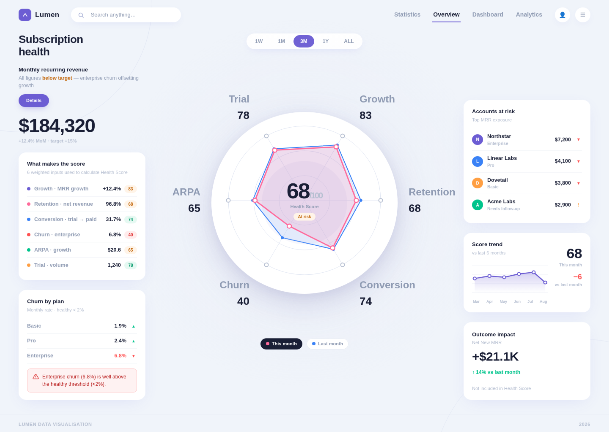

<p align="center">
  
</p>

# Decision-First Dashboard

### Stop AI from turning every dashboard into the same 4 KPI cards + chart + table.

Most AI dashboard redesigns look cleaner.

They don't necessarily get smarter.

**Decision-First Dashboard makes AI figure out what the dashboard is actually for before redesigning it.**

> **What matters → Why → What should I do?**

## Less dashboard. More decision.

Give it a messy dashboard, screenshot, Figma frame, existing dashboard code, or dataset.

Instead of treating every metric as equally important, it asks:

> **If this number changes, would you actually do something differently?**

The important signals move up.

The supporting details move down.

The noise gets out of the way.

**Keep the data. Lose the clutter.**

## No made-up insights

No random **“Health Score: 82.”**

No radar chart just because radar charts look fancy.

No pretending unrelated metrics belong together.

If the evidence supports a score, use it.

If it doesn't, show the real signals instead.

## Before → After

**Before:** dozens of metrics competing for attention.

**After:** what matters, why it changed, and what needs attention next.

<table>
  <tr>
    <th width="50%">Before</th>
    <th width="50%">No-score mode — no unsupported score invented</th>
  </tr>
  <tr>
    <td width="50%"></td>
    <td width="50%"></td>
  </tr>
</table>

## How it works

You don't need to know the perfect KPI set or chart type first.

The skill asks only enough questions to understand the decision and what action could change. Then it routes the available metrics by role instead of putting everything on the first screen.

A source can contain 70 valid KPIs without becoming a 70-KPI dashboard.

> **Preserve everything without showing everything.**

Metrics are routed as `primary_signal`, `diagnostic`, `exception`, `drilldown`, or `scorecard_only`.

The first view keeps the minimum sufficient decision signals plus active exceptions. Everything else stays available for diagnosis, drilldown, or traceability.

## Two evidence modes

### No-score mode — no unsupported score invented

If the source does not contain a defensible composite model, the skill does **not** make one up.

It can still show direction, important changes, exceptions, and a true 3–6 dimension radar profile when those dimensions are genuinely comparable on one source-grounded scale.

Unrelated raw KPIs are not forced into a radar chart.

### Composite mode — when the evidence supports it

If the source already provides a real score model — including the score, scale, normalized components, weights, aggregation rule, and score bands — the skill can render the score as the dominant decision signal.



If those facts are missing, it falls back to `no_score` instead of guessing.

## Install

```bash
npx skills add fourleaf13-hue/decision-first-dashboard
```

## Use

Give your agent a dashboard screenshot, Figma frame, existing dashboard code, or verified metrics and ask:

> Redesign this dashboard using the `decision-first-dashboard` skill.

The skill will clarify the decision if needed, route the metrics, verify source support, and render the decision-first output.

<details>
<summary><strong>Under the hood</strong></summary>

### Adaptive Decision Brief

The skill asks one question at a time, no more than five, and stops as soon as it has enough confirmed context. Source facts can suggest intent, but they do not silently become business intent. Unless Decision + Action are already explicit, the skill asks for confirmation before routing or rendering.

### Metric Router

The Action Trigger Test asks: **if this metric changes materially, what decision or action changes?**

The routing manifest preserves the complete extracted inventory while keeping only the minimum sufficient first-view signals visible. Active exceptions cannot be hidden to make the dashboard look healthier.

### Grounding

The production compiler has two hard gates:

1. **Routing gate** — verifies metric-routing semantics.
2. **Grounding gate** — verifies that rendered source claims resolve back to source evidence.

Machine-readable transitions are:

```text
PASS
FIX_METRIC_ROUTING
RETURN_TO_EVIDENCE_EXTRACTION
FALLBACK_TO_NO_SCORE
FIX_DECISION_STATE
```

Composite output is allowed only when all score-model facts are mechanically grounded. Screenshot workflows should first create a verifiable text/JSON sidecar for claims that need byte-level grounding.

### Visual rules

- no four-equal-KPI top row;
- no dominant giant table;
- 3–6 primary signals in the first-view center;
- radar only for 3–6 comparable peer dimensions on one grounded scale;
- no invented action buttons, targets, scores, weights, or thresholds;
- active negative/critical exceptions cannot be cosmetically suppressed;
- SVG and HTML consume the same validated decision state.

### Production path

```text
Decision Brief
→ evidence extraction
→ Metric Router
→ no_score / composite decision
→ grounded decision state
→ routing validation
→ grounding validation
→ deterministic render
```

From the skill directory:

```bash
node scripts/compile-dashboard.js path/to/routing-manifest.json path/to/grounded-bundle.json path/to/output-directory
```

Mode-specific outputs:

```text
no_score   → output.no-score.svg / output.no-score.html
composite  → output.composite.svg / output.composite.html
```

</details>

## Development

```bash
npm test
npm run validate:saas
npm run render:saas
```

GitHub Actions runs the compiler test suite, including Decision Brief intake, 70-KPI Metric Router behavior, routed production compilation, grounded composite/no-score compilation, radar rendering, and byte-level golden snapshots.

## What this is not

This is not a generic chart library and not a prompt that asks AI to freestyle a prettier admin dashboard.

It is a decision-first workflow with routing, evidence checks, and deterministic rendering so the output is useful **and** auditable.

## License

MIT
