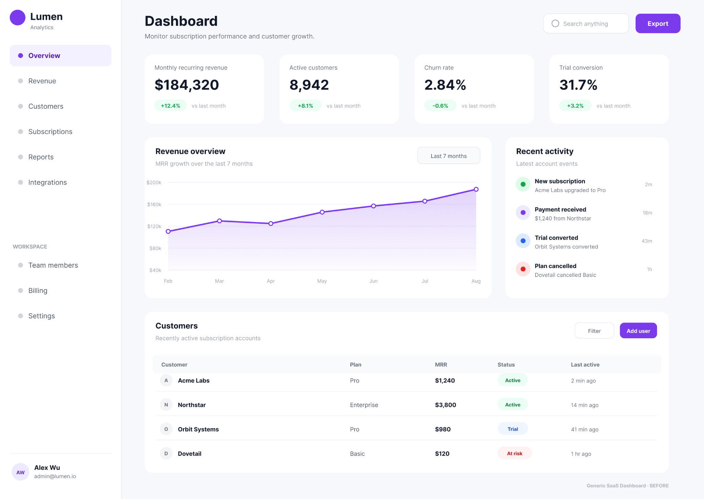
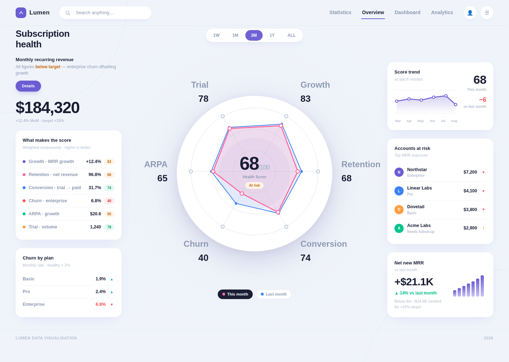

# Decision-First Dashboard

Turn dashboards people have to read into dashboards people can understand at a glance.

Most dashboards organize data. This skill organizes decisions.

> **Many metrics → Minimum sufficient decision signals → Diagnosis → Action**

Decision-First Dashboard is an Agent Skill for redesigning KPI-heavy dashboards around the decision a user actually needs to make.

It is a reusable decision-design framework **plus a visual translation grammar** for turning:

**many metrics → minimum sufficient decision signals → diagnosis → action**

Instead of treating every KPI as equally important, it helps an agent determine:

- who is looking;
- what decision they are trying to make;
- which metrics are outcomes, drivers, diagnostics, or action data;
- whether the metrics can defensibly form one composite signal;
- what should dominate the visual hierarchy;
- what requires intervention.

The visual style can change, but the result should preserve a clear visual grammar: one dominant synthesis area, supporting diagnosis, visible action targets, restrained product-native styling, and no exposed framework labels.

## Before → After

<table>
  <tr>
    <th width="50%">Before</th>
    <th width="50%">After</th>
  </tr>
  <tr>
    <td width="50%">
      
    </td>
    <td width="50%">
      
    </td>
  </tr>
</table>

The Before dashboard is clean, but users still have to scan independent KPI cards, a trend chart, an activity feed, and a customer table before constructing a mental model.

The After example reorganizes the same type of executive dashboard around a dominant subscription-health signal, diagnosis, account-level action targets, trend, and business impact.

> The After image is an example of **composite mode**. A composite score should only be used when its normalization, thresholds, and weights are defensible. Otherwise the skill uses multiple primary signals instead of inventing a score.

## Install

Install this skill with any Agent Skills-compatible client:

```bash
npx skills add fourleaf13-hue/decision-first-dashboard
```

## Quick start

Install the skill:

```bash
npx skills add fourleaf13-hue/decision-first-dashboard
```

Then give your agent a dashboard screenshot, Figma frame, or existing dashboard code and ask:

> Redesign this dashboard using the `decision-first-dashboard` skill. First identify the primary user and decision. Do not change the visual style until the decision hierarchy is clear.

## Core idea

A dashboard should not force the user to construct the conclusion themselves.

A typical KPI-first dashboard often looks like:

```text
KPI   KPI   KPI   KPI

Chart             Activity

Table
```

A decision-first dashboard instead asks:

```text
What does the user need to decide?
        ↓
What is the minimum sufficient signal?
        ↓
Why is it happening?
        ↓
Where / who requires attention?
        ↓
What action follows?
```

## One signal is not always the answer

The skill does **not** require every dashboard to have one Health Score.

It branches:

```text
Can these metrics defensibly form one signal?

YES → composite mode
      one dominant signal + drivers + diagnosis + action

NO  → multi-signal mode
      2–4 primary signals + diagnosis + action
```

This prevents agents from inventing arbitrary score math simply because a 0–100 gauge looks clean.

## Who is looking changes the dashboard

The same underlying data should not produce the same hierarchy for every role.

### CEO / Founder

Prioritize:

- synthesis;
- business impact;
- high-value exceptions;
- a small number of action targets.

### Operator / Analyst

Prioritize:

- diagnosability;
- segment and cohort detail;
- drill-down;
- potentially multiple primary signals.

`Who is looking?` is therefore a design input, not a checklist question.

## Hard-stop conditions

Safety, compliance, security, regulatory, or contractual conditions can be **hard stops**.

A hard-stop metric must not be averaged into a reassuring composite score.

Example:

```text
Operational Health: 84 / Healthy
Safety Incident: ACTIVE
```

is a bad hierarchy.

The hard stop should override the normal interpretation:

```text
CRITICAL
Active safety incident

Normal operational health interpretation suspended.
```

## Visual translation

The skill now separates **reasoning** from **rendering**.

Reasoning concepts such as `Decision`, `Diagnostic`, `Outcome`, and `Actionable` stay backstage. They determine prominence and grouping; they should not normally appear as UI labels.

For executive dashboards, the preferred composition is:

```text
WHY / WHERE   →   OVERALL STATE   ←   WHO / TREND / IMPACT
```

If a defensible composite exists, the overall state can be a score/status. If not, use an evidence-bounded synthesis such as **Improving — target unknown** rather than inventing a score.

See [`skills/decision-first-dashboard/references/visual-pattern.md`](skills/decision-first-dashboard/references/visual-pattern.md).

## Tests

The repository includes pressure scenarios for:

- SaaS dashboards;
- SaaS dashboards without score rules;
- visual-output regressions;
- evidence-scope / data-integrity behavior;
- e-commerce dashboards;
- operations dashboards with hard-stop conditions.

These scenarios are used to test whether an agent follows the method instead of defaulting to generic KPI-card layouts.

## Repository structure

```text
decision-first-dashboard/
├── README.md
├── LICENSE
├── examples/
│   └── saas/
│       ├── before.png
│       ├── after.png
│       └── reasoning.md
├── skills/
│   └── decision-first-dashboard/
│       ├── SKILL.md
│       └── references/
│           ├── visual-pattern.md
│           └── after-reference.png
└── tests/
    ├── saas.md
    ├── saas-no-score.md
    ├── visual-output.md
    ├── evidence-scope.md
    ├── ecommerce.md
    └── operations.md
```

## What this is not

This is not a chart-style library.

It does not prescribe radar charts, gauges, gradients, card styles, or a specific visual language.

It is intended to change the **decision hierarchy** before changing the visual style.

## License

MIT
