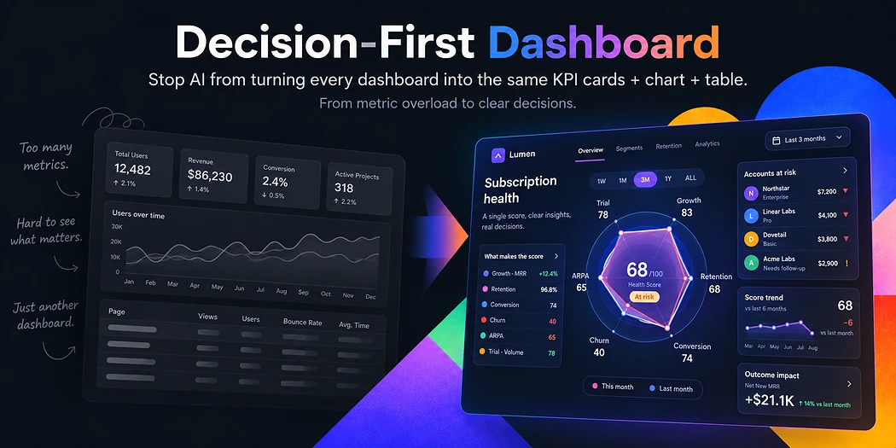
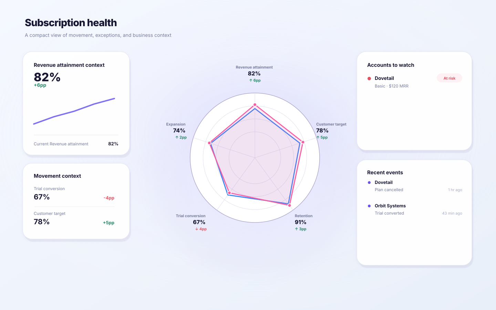

<p align="center">
  
</p>

# Decision-First Dashboard

### Stop AI from turning every dashboard into the same 4 KPI cards + chart + table.

Most AI dashboard redesigns look cleaner.

They don't necessarily get smarter.

**Decision-First Dashboard first asks whether the dashboard deserves to exist — then figures out what decision it is actually for.**

> **What matters → Why → What should I do?**

## Sometimes the right dashboard is no dashboard

Before redesigning anything, it asks:

> **Does this need to be a dashboard at all?**

A dashboard should support a **recurring decision or monitoring loop**, have a clear **accountability path**, and change an action, priority, escalation, intervention, or coordination when an important signal changes.

That accountability path can be one owner, an on-call team, or a recurring shared forum such as a board or cross-functional review. It does not have to be one named person.

“Visibility” alone isn't enough.

If the real job is one-off or passive, the skill can recommend a **one-off analysis**, **scheduled summary**, **alert**, report, or chat/query workflow instead of forcing another dashboard into existence.

## Less dashboard. More decision.

Give it a messy dashboard, screenshot, Figma frame, existing dashboard code, or dataset.

Instead of treating every metric as equally important, it asks:

> **If this number changes, would you actually do something differently?**

The important signals move up.

The supporting details move down.

The noise gets out of the way.

**Keep the data. Lose the clutter.**

## No made-up insights

No random **“Health Score: 82.”**

No radar chart just because radar charts look fancy.

No pretending unrelated metrics belong together.

If the evidence supports a score, use it.

If it doesn't, show the real signals instead.

## Before → After

**Before:** dozens of metrics competing for attention.

**After:** what matters, why it changed, and what needs attention next.

<table>
  <tr>
    <th width="50%">Before</th>
    <th width="50%">No-score radar profile — no unsupported score invented</th>
  </tr>
  <tr>
    <td width="50%"></td>
    <td width="50%"></td>
  </tr>
</table>

The After showcase uses five source-backed percentage dimensions on one 0–100 scale, so the radar is real rather than decorative. Mixed-unit raw KPIs still use the non-radar fallback.

## How it works

You don't need to know the perfect KPI set or chart type first.

The skill first checks whether a persistent dashboard is warranted. If it is, it asks only enough questions to understand the decision and what action could change. **Decision and Action must be explicitly confirmed before routing or rendering can proceed.** Then it routes the available metrics by role instead of putting everything on the first screen.

A source can contain 70 valid KPIs without becoming a 70-KPI dashboard.

> **Preserve everything without showing everything.**

Metrics are routed as `primary_signal`, `diagnostic`, `exception`, `drilldown`, or `scorecard_only`.

The first view keeps the minimum sufficient decision signals plus active exceptions. Everything else stays available for diagnosis, drilldown, or traceability.

## Two evidence modes

### No-score mode — no unsupported score invented

If the source does not contain a defensible composite model, the skill does **not** make one up.

It can still show direction, important changes, exceptions, and a true 3–6 dimension radar profile when those dimensions are genuinely comparable on one source-grounded scale.

Unrelated raw KPIs are not forced into a radar chart.

### Composite mode — when the evidence supports it

If the source already provides a real score model — including the score, scale, normalized components, weights, aggregation rule, and score bands — the skill can preserve and display that grounded score without forcing it into the radar center.


If those facts are missing, it falls back to `no_score` instead of guessing.

## Install

```bash
npx skills add fourleaf13-hue/decision-first-dashboard
```

### Claude workspace — Upload skill

For Claude's **Skills → Upload skill** flow, use the dedicated `decision-first-dashboard-skill` artifact from the latest successful [Compiler tests](https://github.com/fourleaf13-hue/decision-first-dashboard/actions/workflows/compiler-tests.yml) run. Download that artifact ZIP and upload it directly to Claude.

That artifact is built from only `skills/decision-first-dashboard/`, with `SKILL.md` at the ZIP root and without `.claude-plugin/plugin.json`.

**Do not use GitHub's Download ZIP for Claude Upload skill.** The repository ZIP contains the plugin manifest and nests `SKILL.md` under the repository/skill folders, which Claude rejects for a standalone skill upload.

The repository is also packaged as a standard Claude plugin via `.claude-plugin/plugin.json` for Anthropic Plugin Directory submission. The plugin package and the standalone Claude Upload Skill package intentionally remain separate.

## Use

Give your agent a dashboard screenshot, Figma frame, existing dashboard code, or verified metrics and ask:

> Redesign this dashboard using the `decision-first-dashboard` skill.

The skill will first check whether a dashboard is the right format. If it is, it clarifies the decision if needed, routes the metrics, verifies source support, and renders the decision-first output.

An ambiguous prompt such as “redesign this dashboard” is **not render permission**. A screenshot can establish source facts, but it cannot silently confirm the user's Decision or Action. If either is unresolved, the machine intake gate returns `ASK_DECISION_BRIEF_QUESTION` and no dashboard artifact is produced.

**HTML is the primary After deliverable** when file generation is available: use the canonical `output.no-score.html` or `output.composite.html` written by `compile-dashboard.js`. SVG remains the static preview/support artifact for README comparisons, review, and regression testing rather than the main user deliverable.

The canonical compiler also writes `output.manifest.json` and stamps the HTML/SVG with machine-verifiable provenance. A second agent-authored HTML, image, SVG, React app, or native artifact is not the canonical After merely because it looks better.

Attention is intentionally restrained by default. Ordinary deterioration and routed exceptions stay visible through values, deltas, profile shape, and compact exception surfaces; large red warning banners, alarm icons, and `Action needed` / `Critical` / `Warning` language require explicit source-grounded alert semantics or an explicit user-supplied alert policy.

<details>
<summary><strong>Under the hood</strong></summary>

### Dashboard Worthiness Test

Before the Decision Brief, the agent produces a structured assessment matching `schemas/worthiness-assessment.schema.json`.

It records whether there is a recurring decision or monitoring loop, an accountability path, and a response that changes. A shared decision forum is a valid accountability path; a single named owner is not required.

The agent does **not** choose the next transition. The compiler validates the assessment and decides:

```text
BUILD_DECISION_BRIEF
ASK_WORTHINESS_QUESTION
REDIRECT_NON_DASHBOARD
FIX_WORTHINESS_ASSESSMENT
```

If the request is only “visibility” or is better handled as a one-off analysis, scheduled summary, alert, report, or chat/query workflow, dashboard rendering stops by default. If the user explicitly chooses a dashboard after seeing that trade-off, `userOverride: true` can continue to the Decision Brief — but it still must pass intake, routing, and grounding.

This machine gate checks schema and internal semantic consistency. **It does not prove the agent interpreted the user's natural-language intent correctly.** Live host/model behavior still requires end-to-end evaluation.

Any Worthiness questions count toward the same five-question intake budget as the Decision Brief; this is not a second questionnaire.

### Adaptive Decision Brief + machine intake gate

The skill asks one question at a time, no more than five total across Worthiness + Decision Brief intake, and stops as soon as it has enough confirmed context. Source facts can suggest intent, but they do not silently become business intent.

The structured Decision Brief matches `schemas/decision-brief.schema.json`. `scripts/intake.js` requires both `decision.status` and `action.status` to be `confirmed` before routing is allowed:

```text
ALLOW_ROUTING
ASK_DECISION_BRIEF_QUESTION
FIX_DECISION_BRIEF
```

An inferred Decision or Action is not equivalent to confirmation. The routing manifest must also preserve the confirmed Decision and Action wording; changing either downstream is a routing failure.

### Metric Router

The Action Trigger Test asks: **if this metric changes materially, what decision or action changes?**

The routing manifest preserves the complete extracted inventory while keeping only the minimum sufficient first-view signals visible. Active exceptions cannot be hidden to make the dashboard look healthier.

### Four production gates

The canonical production compiler has four ordered gates:

1. **Worthiness gate** — validates the structured Worthiness Assessment and decides whether to continue, clarify, redirect, or repair the assessment.
2. **Intake gate** — validates the Decision Brief and blocks routing until Decision + Action are confirmed.
3. **Routing gate** — verifies metric-routing semantics and exact binding to the confirmed Decision + Action.
4. **Grounding gate** — verifies that rendered source claims resolve back to source evidence.

Downstream transitions include:

```text
ALLOW_ROUTING
ASK_DECISION_BRIEF_QUESTION
FIX_DECISION_BRIEF
PASS
FIX_METRIC_ROUTING
RETURN_TO_EVIDENCE_EXTRACTION
FALLBACK_TO_NO_SCORE
FIX_DECISION_STATE
```

Composite output is allowed only when all score-model facts are mechanically grounded. Screenshot workflows should first create a verifiable text/JSON sidecar for claims that need byte-level grounding.

### Canonical output provenance

A successful `compile-dashboard.js` run stamps the final HTML with canonical renderer metadata and embeds a provenance record in the SVG. It also writes `output.manifest.json` containing hashes for the source, Worthiness Assessment, Decision Brief, routing manifest, grounded bundle, decision state, HTML, and SVG.

This turns “does this look like our renderer?” into a machine-verifiable question. If a final artifact does not have canonical provenance, it is not the canonical Decision-First After.

The repository also includes a recorded agent E2E regression based on a real ambiguous Sales Dashboard prompt. The passing first turn asks one question for missing decision context; a native artifact that skips intake is rejected. This is a deterministic recorded-turn contract, not a live model benchmark.

### Visual rules

- no four-equal-KPI top row;
- no dominant giant table;
- 3–6 primary signals in the first-view center;
- radar only for 3–6 comparable peer dimensions on one grounded scale;
- no invented action buttons, targets, scores, weights, or thresholds;
- active negative/critical exceptions cannot be cosmetically suppressed;
- soft attention is the default; hard-alert treatment requires explicit source-grounded alert semantics;
- SVG and HTML consume the same validated decision state, with HTML as the primary user-facing deliverable and SVG as preview/support output.

### Production path

```text
User context
→ structured Worthiness Assessment
→ worthiness validation
→ structured Decision Brief
→ intake validation
→ evidence extraction
→ Metric Router
→ no_score / composite decision
→ grounded decision state
→ routing validation
→ grounding validation
→ deterministic render
→ canonical HTML / SVG + output.manifest.json
```

From the skill directory:

```bash
node scripts/worthiness.js path/to/worthiness-assessment.json
node scripts/intake.js path/to/decision-brief.json
node scripts/compile-dashboard.js path/to/worthiness-assessment.json path/to/decision-brief.json path/to/routing-manifest.json path/to/grounded-bundle.json path/to/output-directory
```

Mode-specific outputs:

```text
no_score   → primary: output.no-score.html    | preview: output.no-score.svg
composite  → primary: output.composite.html   | preview: output.composite.svg
both       → audit: output.manifest.json
```

</details>

## Development

```bash
npm test
npm run package:claude-skill
npm run validate:saas
npm run render:saas
npm run validate:radar-showcase
npm run render:radar-showcase
```

For Anthropic plugin packaging, validate the repository root with a current Claude Code CLI before submission:

```bash
claude plugin validate . --strict
```

GitHub Actions runs the compiler suite, including the plugin manifest contract, executable Worthiness scenario fixtures, the machine Decision Brief intake gate, the recorded ambiguous-prompt agent E2E contract, 70-KPI Metric Router behavior, canonical provenance, routed production compilation, grounded composite/no-score compilation, radar rendering, byte-level golden snapshots, the HTML delivery/attention-intensity contract, and the standalone Claude Upload Skill packaging contract.

## What this is not

This is not a generic chart library and not a prompt that asks AI to freestyle a prettier admin dashboard.

It is a decision-first workflow with worthiness, intake, routing, evidence checks, canonical provenance, and deterministic rendering so the output is useful **and** auditable.

## License

MIT